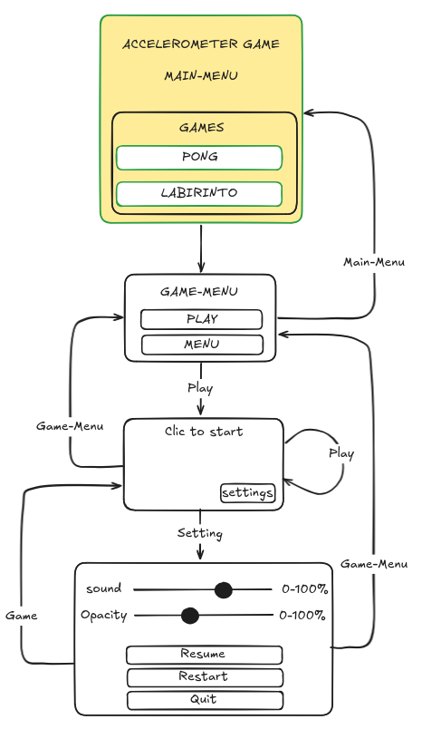
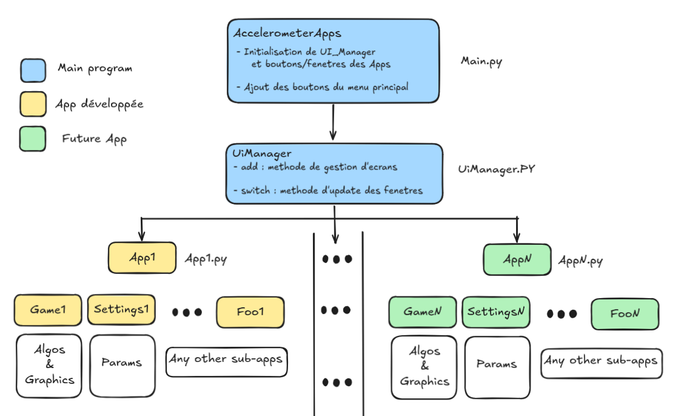

# Table des matières 
- *(1) Game master*
- *(2) Games in developpement*
- *(3) For whom is willing to contribute*
- *(4) Sources*


# *1) GAME MASTER*

---

## 1.1) The concept
Inspired from online websites like jeux.fr or all-in-one chinese applications, this app is meant to be maintained for future mini-games integration. Momentaly we mean to dev the following :

- Play the mythic Pong game but while using your own accelerometer to guide the platform to return the ball.

- The epic mecanical "labrinto" game digitaly transform with an accelerometer

- Nothing more for the moment...



---

## 1.2) Main structure off the project

```text
root/
├── main.py 
├── imports.py             #   Modules kivy standards
├── README.md
├── Journal.md
└── Apps/
    ├── __init__.py        #  Initialisation de kivy
    ├── Pong/
    │   ├── __init__.py
    │   ├── PongApp.py      #   Object simply callable from main
    │   ├── PongGame.py     #   Algos Pong
    │   ├── PongUI.py
    │   ├── PongSettings.py
    │   └── pong.kv         #   UI widgets Pong
    │
    ├── Template/           # Not updated 
    │   ├── __init__.py
    │   ├── LabirintoApp.py
    │   ├── LabirintoGame.py
    │   └── labirinto.kv
    └── UiManager.py        #   Helps to integrate new apps to the salsa
```




# *2) Games in developpement*

## *2.1) Pong with an accelerometer* (statut : en développement)

### 2.1.1) The game 
Well... It's pong you know. Just incline the device to move a paddle instead of touch the screen.

### 2.1.2) The structure


### 2.1.3) Next steps
-   Add socket multiplayer mode for pong
-   Add some pretty graphics


## 2.2) *Labirinto* (statut : non-développé)

### 2.2.1) The game
To explain later

### 2.2.2) Next steps
-   Add some pretty graphics


# *3) For the ones who wants to contribute*
TODO
### create a template App class or a craft.sh script to easily add a new app 


# *4) Sources*

-   Tutoriel kivy pour le jeu pong  : https://

-   Génération de son avec kivy     : https://

-   Cours génialissime de Mme. Duay : ...

-   Online Free Mistral Chat        : https://chat.mistral.ai/chat/


